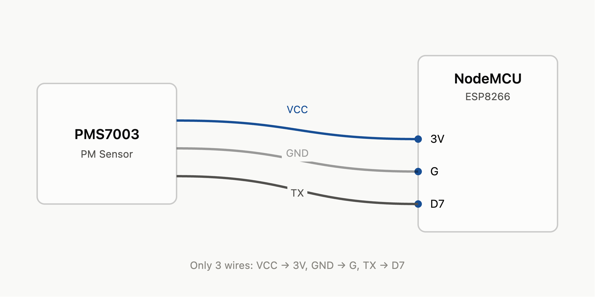

# How to set up a MING stack

MING stack includes Mosquitto/MQTT, InfluxDB, Node-RED, and Grafana. This powerful combination of open-source tools is intended to simplify IoT data management.

## Sensor PMS7003

  

<b>Figure 1.</b> Simplified connections between sensor PMS7003 and Nodemcu microcontroller.

