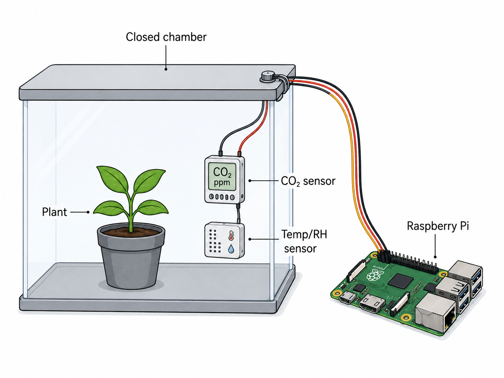

# Practical Activity 1 – Measuring Plant Photosynthesis and Respiration Using an IoT Monitoring Chamber

## Title

**Monitoring Plant Photosynthesis and Respiration Using Low-Cost IoT Sensors**

---

## Experimental Setup

  

<b>Figure 1.</b> Experimental IoT chamber used to monitor plant gas exchange. A potted plant is enclosed in a transparent chamber equipped with a Sensirion SCD4x photoacoustic CO₂ sensor, temperature and relative humidity sensors connected to a Raspberry Pi for real-time data acquisition.

## Learning Objectives

By the end of this activity, participants will be able to:

- Understand the relationship between solar radiation, photosynthesis, and plant respiration.
- Assemble and operate a low-cost IoT-based environmental monitoring system.
- Measure temporal variations in CO₂ concentration, air temperature, and relative humidity inside plant chambers.
- Compare plant physiological responses under illuminated and dark conditions.
- Interpret experimental data to distinguish photosynthetic carbon uptake from respiratory carbon release.
- Evaluate the performance of low-cost CO₂ sensors by comparing them with reference-grade instruments.

---

## Background

Plants continuously exchange carbon dioxide (CO₂) and water vapor with the atmosphere. During daylight, photosynthesis consumes atmospheric CO₂ while releasing oxygen, whereas respiration continuously releases CO₂ regardless of light availability.

By comparing plants exposed to natural light with plants kept in darkness, it is possible to isolate the contribution of photosynthesis to the ecosystem carbon balance. This experiment demonstrates these processes using an Internet of Things (IoT) monitoring system based on low-cost environmental sensors connected to Raspberry Pi computers.

An additional objective of this activity is to evaluate the performance of the **Sensirion SCD4x photoacoustic CO₂ sensor**, comparing its measurements with one or more reference-grade CO₂ analyzers commonly used in environmental research.

---

# Experimental Setup

Each student group will:

- Collect one or two small potted plants from the surrounding vegetation.
- Install the plants inside transparent monitoring chambers.
- Connect each chamber to an IoT monitoring system built around a Raspberry Pi.
- Install environmental sensors for continuous monitoring.
- Configure automatic data acquisition.
- Monitor environmental variables throughout the experiment.

## Sensors

Each chamber will include:

- **Sensirion SCD4x photoacoustic CO₂ sensor**
- Air temperature sensor
- Relative humidity sensor
- Raspberry Pi data logger

In parallel, measurements will also be obtained using **reference CO₂ analyzers** to evaluate the accuracy, stability, and response of the low-cost SCD4x sensor under experimental conditions.

---

# Experimental Treatments

Two experimental treatments will be conducted simultaneously.

## Chamber A – Control

- Transparent chamber
- Natural solar radiation reaches the plant
- Photosynthesis and respiration occur simultaneously

## Chamber B – Dark Treatment

- Chamber covered with an opaque material
- Solar radiation is completely blocked
- Photosynthesis is inhibited
- Only plant respiration remains active

---

# Measurements

The IoT system will continuously record:

- CO₂ concentration (ppm)
- Air temperature (°C)
- Relative humidity (%)
- Timestamp

Recommended sampling interval:

- Every 10–30 seconds

Monitoring duration:

- Approximately 60–90 minutes

Reference CO₂ instruments will simultaneously record CO₂ concentrations for comparison with the SCD4x sensor.

---

# Expected Results

## Control Chamber

Students should observe:

- Progressive decrease in CO₂ concentration due to photosynthesis.
- Increase in relative humidity caused by transpiration.
- Small variations in air temperature.

## Dark Chamber

Students should observe:

- Increase in CO₂ concentration due to plant respiration.
- Reduced transpiration.
- Different humidity dynamics compared to the illuminated chamber.

---

# Sensor Performance Evaluation

Participants will compare measurements obtained from the **SCD4x photoacoustic sensor** with those from the reference CO₂ analyzer(s).

The comparison may include:

- Time-series agreement
- Measurement bias
- Precision
- Response time
- Sensor stability
- Suitability for environmental IoT applications

This exercise provides an opportunity to discuss the advantages and limitations of low-cost sensors for environmental monitoring.

---

# Data Analysis

Participants will:

1. Plot CO₂ concentration versus time.
2. Plot relative humidity versus time.
3. Plot air temperature versus time.
4. Compare illuminated and dark treatments.
5. Compare measurements from the SCD4x sensor with the reference CO₂ analyzer(s).
6. Estimate:

   - Net photosynthetic CO₂ uptake
   - Respiratory CO₂ production
   - Water vapor dynamics

Students will discuss:

- Why CO₂ decreases only under illumination.
- Why respiration continues during both treatments.
- The relationship between photosynthesis and transpiration.
- The accuracy and limitations of low-cost environmental sensors.
- Sources of experimental uncertainty.

---

# Discussion Questions

- Why is photosynthesis dependent on solar radiation?
- Why does respiration continue in both light and darkness?
- Which environmental variables most strongly influence gas exchange?
- How would increased light intensity affect the observed CO₂ dynamics?
- How would drought stress alter these responses?
- What are the advantages and limitations of using low-cost photoacoustic CO₂ sensors for environmental monitoring?

---

# Skills Acquired

Participants will gain practical experience in:

- Plant ecophysiology
- Biosphere–atmosphere interactions
- Carbon cycling
- Environmental sensor calibration
- Raspberry Pi programming
- IoT system development
- Environmental data acquisition
- Time-series analysis
- Experimental design
- Validation of low-cost environmental sensors
- Scientific interpretation of ecosystem processes

---

# Expected Outputs

At the end of the activity, each group will produce:

- A complete environmental dataset.
- Time-series plots of CO₂, temperature, and relative humidity.
- A comparison between illuminated and dark chambers.
- A comparison between the SCD4x sensor and reference CO₂ analyzer(s).
- A short presentation discussing the observed physiological processes and evaluating the performance of the low-cost IoT monitoring system.

---

## Summary

This practical activity introduces participants to biosphere–atmosphere interactions through a hands-on experiment combining plant ecophysiology, environmental monitoring, and Internet of Things (IoT) technologies. Using the **Sensirion SCD4x photoacoustic CO₂ sensor**, Raspberry Pi data loggers, and reference-grade CO₂ analyzers, students will investigate how solar radiation controls photosynthesis and respiration while also learning how to assess the performance of low-cost sensors for environmental research.
