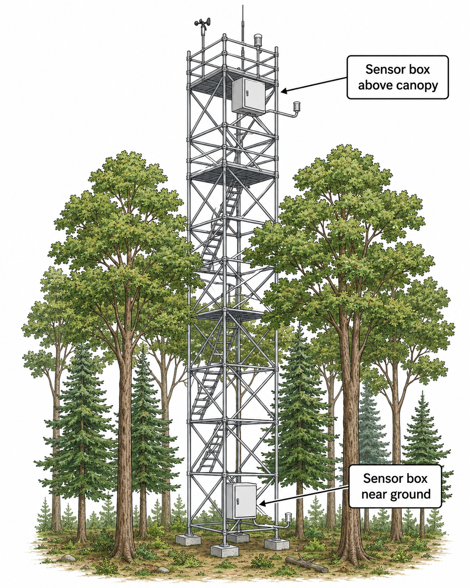

# Practical Activity 2 – Vertical Monitoring of Particulate Matter in a Forest Tower

## Title

**Monitoring PM1.0, PM2.5 and PM10 at Different Heights in a Forest Canopy Using Low-Cost Optical Sensors**

---

  

<b>Figure 1.</b> Instalation of Particulate Matter sensors at the tower.

## Learning Objectives

By the end of this activity, participants will be able to:

* Understand how particulate matter concentrations vary vertically within and above a forest canopy.
* Install and operate low-cost optical particulate matter sensors in a micrometeorological tower.
* Compare PM dynamics at two different heights inside the forest.
* Evaluate the performance of two low-cost optical sensor models: **Nova SDS011** and **Plantower PMS7003**.
* Analyse time-series data of PM1.0, PM2.5 and PM10 in relation to forest structure and atmospheric turbulence.
* Discuss the advantages and limitations of low-cost particulate matter sensors for environmental monitoring.

---

## Background

Particulate matter (PM) is composed of small solid or liquid particles suspended in the atmosphere. These particles are commonly classified according to their aerodynamic diameter, such as PM1.0, PM2.5 and PM10.

Forests can modify the concentration and transport of particulate matter by acting both as physical filters and as complex turbulent environments. Inside the canopy, wind speed is usually reduced, turbulence is modified, and particles may be intercepted by leaves, branches and stems. Above or near the upper canopy, atmospheric mixing is typically stronger, which may lead to different PM dynamics compared with lower levels inside the forest.

In this activity, students will install low-cost particulate matter sensors at two heights in a forest measurement tower. The experiment will compare the temporal dynamics of PM1.0, PM2.5 and PM10 and evaluate differences between two optical sensor models: **SDS011** and **PMS7003**.

The SDS011 is a laser-scattering sensor commonly used for PM2.5 and PM10 measurements, while the PMS7003 provides particulate matter outputs including PM1.0, PM2.5 and PM10. Therefore, the comparison between SDS011 and PMS7003 will focus mainly on PM2.5 and PM10, while PM1.0 will be analysed using PMS7003 data.

---

## Experimental Setup

Participants will install particulate matter monitoring units at two different heights in a forest atmospheric measurement tower.

Suggested heights:

* **Lower level:** inside the forest canopy, close to the understory or trunk space.
* **Upper level:** higher inside the canopy or near the canopy top, depending on tower access and safety conditions.

Each monitoring level should include:

* One **SDS011** particulate matter sensor.
* One **PMS7003** particulate matter sensor.
* Air temperature and relative humidity sensor.
* Raspberry Pi or microcontroller-based data logger.
* Power supply or battery system.
* Weatherproof enclosure with protected air inlet and outlet.
* Timestamped data acquisition system using MQTT, InfluxDB, Node-RED and Grafana, when available.

---

## Sensors

### SDS011

The SDS011 will be used to measure:

* PM2.5 concentration
* PM10 concentration

### PMS7003

The PMS7003 will be used to measure:

* PM1.0 concentration
* PM2.5 concentration
* PM10 concentration

### Supporting Environmental Variables

At each height, the following variables should also be recorded:

* Air temperature
* Relative humidity
* Timestamp
* Sensor height
* Sensor model
* Optional: wind speed, wind direction, pressure, rainfall or turbulence data, if available from the tower instrumentation.

---

## Field Procedure

### 1. Preparation Before Climbing the Tower

Before installing the sensors, each group should:

1. Check the sensor wiring and power supply.
2. Confirm that the SDS011 and PMS7003 are communicating with the data logger.
3. Verify that the timestamp is correct.
4. Label each sensor unit with:

   * Sensor model
   * Height level
   * Group name
   * Date and time of installation
5. Test data transmission to the local database or computer.
6. Protect the electronics from rain and direct water exposure.
7. Ensure that air inlets are not blocked by the enclosure.

---

### 2. Tower Installation

With supervision and following all safety rules, participants will:

1. Install one monitoring unit at the lower forest level.
2. Install one monitoring unit at the upper forest level.
3. Position sensors so that the air inlet is exposed to ambient air.
4. Avoid placing sensors directly against leaves, branches or tower structures.
5. Make sure both sensor models at the same height are positioned as close as possible to each other.
6. Record the exact installation height of each sensor.
7. Record field notes about canopy density, wind conditions and possible local sources of particles.

---

### 3. Data Acquisition

The system will continuously record particulate matter concentrations during the experiment.

Recommended sampling interval:

* Every 10–60 seconds.

Recommended monitoring duration:

* At least 1–3 hours during the practical activity.
* Longer measurements are encouraged if the system can remain safely installed.

The data should include:

* PM1.0 from PMS7003
* PM2.5 from PMS7003
* PM10 from PMS7003
* PM2.5 from SDS011
* PM10 from SDS011
* Temperature
* Relative humidity
* Timestamp
* Sensor height
* Sensor model

---

## Data Analysis

Participants will analyse the collected data using Python, R, Excel or another preferred tool.

The analysis should include:

1. Time-series plots of PM1.0, PM2.5 and PM10 at each height.
2. Comparison between lower and upper forest levels.
3. Comparison between SDS011 and PMS7003 for PM2.5.
4. Comparison between SDS011 and PMS7003 for PM10.
5. Calculation of basic statistics:

   * Mean
   * Median
   * Standard deviation
   * Minimum
   * Maximum
   * Coefficient of variation
6. Calculation of the vertical gradient:

[
\Delta PM = PM_{upper} - PM_{lower}
]

7. Interpretation of periods with increasing or decreasing PM concentration.
8. Evaluation of possible humidity effects on optical PM sensor readings.

---

## Expected Results

Students may observe:

* Different PM concentrations between the lower and upper forest levels.
* Reduced PM variability inside denser parts of the canopy.
* Short-term peaks caused by local particle transport, wind gusts or human activity near the tower.
* Differences between SDS011 and PMS7003 measurements, especially for PM2.5 and PM10.
* Higher uncertainty during periods of elevated relative humidity.
* Distinct temporal behaviour among PM1.0, PM2.5 and PM10.

The results may show whether the forest canopy acts as a sink, filter or mixing layer for particulate matter during the measurement period.

---

## Sensor Performance Evaluation

The comparison between SDS011 and PMS7003 should include:

* Agreement between PM2.5 measurements.
* Agreement between PM10 measurements.
* Mean bias between sensor models.
* Correlation between sensor models.
* Response to short-term PM peaks.
* Stability of measurements over time.
* Influence of relative humidity.
* Suitability of each sensor model for forest atmospheric monitoring.

Suggested plots:

* SDS011 PM2.5 versus PMS7003 PM2.5.
* SDS011 PM10 versus PMS7003 PM10.
* Time series of both sensors at the same height.
* Difference between sensors over time.
* PM concentration versus relative humidity.

---

## Discussion Questions

* How does particulate matter concentration change between the lower and upper forest levels?
* Does the forest canopy appear to reduce, accumulate or redistribute particulate matter?
* Are PM1.0, PM2.5 and PM10 controlled by the same processes?
* Why might PM10 behave differently from PM1.0 or PM2.5?
* How similar are the SDS011 and PMS7003 measurements?
* Which sensor model appears more stable during the experiment?
* How can relative humidity affect optical particulate matter sensors?
* What are the main limitations of using low-cost PM sensors in forest environments?
* How could this experiment be improved with reference-grade instruments?

---

## Skills Acquired

Participants will gain practical experience in:

* Forest micrometeorology
* Atmospheric particulate matter monitoring
* Installation of environmental sensors in field conditions
* Low-cost optical sensor operation
* IoT-based environmental data acquisition
* Data logging using Raspberry Pi or microcontrollers
* Time-series analysis
* Vertical profile interpretation
* Sensor intercomparison
* Evaluation of uncertainty in environmental measurements

---

## Expected Outputs

At the end of the activity, each group will produce:

* A complete dataset of particulate matter measurements.
* Time-series plots of PM1.0, PM2.5 and PM10.
* A comparison between two forest heights.
* A comparison between SDS011 and PMS7003 sensors.
* Basic statistical analysis of PM concentrations.
* A short presentation discussing:

  * Vertical PM dynamics in the forest.
  * Differences among PM size fractions.
  * Sensor performance.
  * Limitations of low-cost optical sensors.
  * Recommendations for future monitoring.

---

## Summary

This practical activity introduces participants to the vertical monitoring of particulate matter in a forest environment using low-cost optical sensors and IoT technologies. By installing SDS011 and PMS7003 sensors at different heights in an atmospheric measurement tower, students will investigate how PM1.0, PM2.5 and PM10 vary within the forest canopy and how different sensor models respond under real field conditions.

The activity combines forest-atmosphere interactions, air quality monitoring, environmental instrumentation and data analysis, providing a hands-on introduction to low-cost sensing for atmospheric research.
